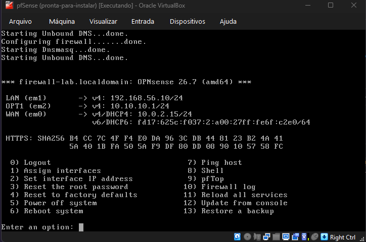

# homelab-firewall

Lab de firewall que montei no VirtualBox, no meu Windows. Uma VM roda o OPNsense 26.7 e fica entre a internet e uma rede interna. Nessa rede interna tem um Ubuntu Server que só sai para fora passando pelo firewall, e só pelas portas que eu liberei.

A VM do firewall se chama pfSense no VirtualBox, mas o sistema instalado nela é o OPNsense.

## Topologia

O OPNsense tem três placas de rede. A WAN sai pelo NAT do VirtualBox. A LAN fica numa rede host-only, que é por onde eu acesso a interface web pelo navegador do Windows. A OPT1 fica na rede interna LAB-LAN, junto com o Ubuntu.

| Interface | Rede no VirtualBox | IP |
|---|---|---|
| WAN em0 | NAT | 10.0.2.15/24 |
| LAN em1 | host-only | 192.168.56.10/24 |
| OPT1 em2 | rede interna LAB-LAN | 10.10.10.1/24 |
| Ubuntu enp0s3 | LAB-LAN | 10.10.10.50/24 |

## Documentação

- [Criando as VMs e instalando o OPNsense](docs/criando-as-vms.md)
- [Instalando o Ubuntu Server](docs/ubuntu-server.md)
- [Ligando o Ubuntu na LAB-LAN](docs/rede-lab-lan.md)
- [Trocando a regra liberada por regras restritas](docs/regras-restritas.md)
- [Lições aprendidas](docs/licoes-aprendidas.md)

O script que criou as VMs está em [configs/create-vms.ps1](configs/create-vms.ps1). Ele mostra a montagem inicial, antes das mudanças que conto em criando-as-vms.md.
