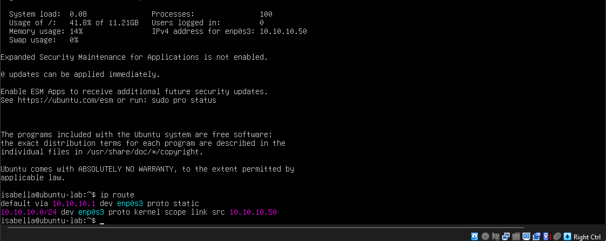
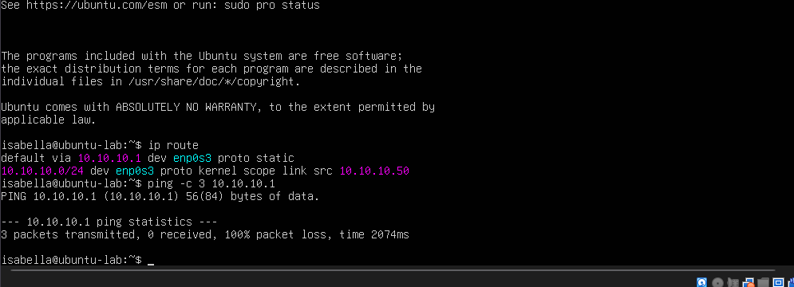
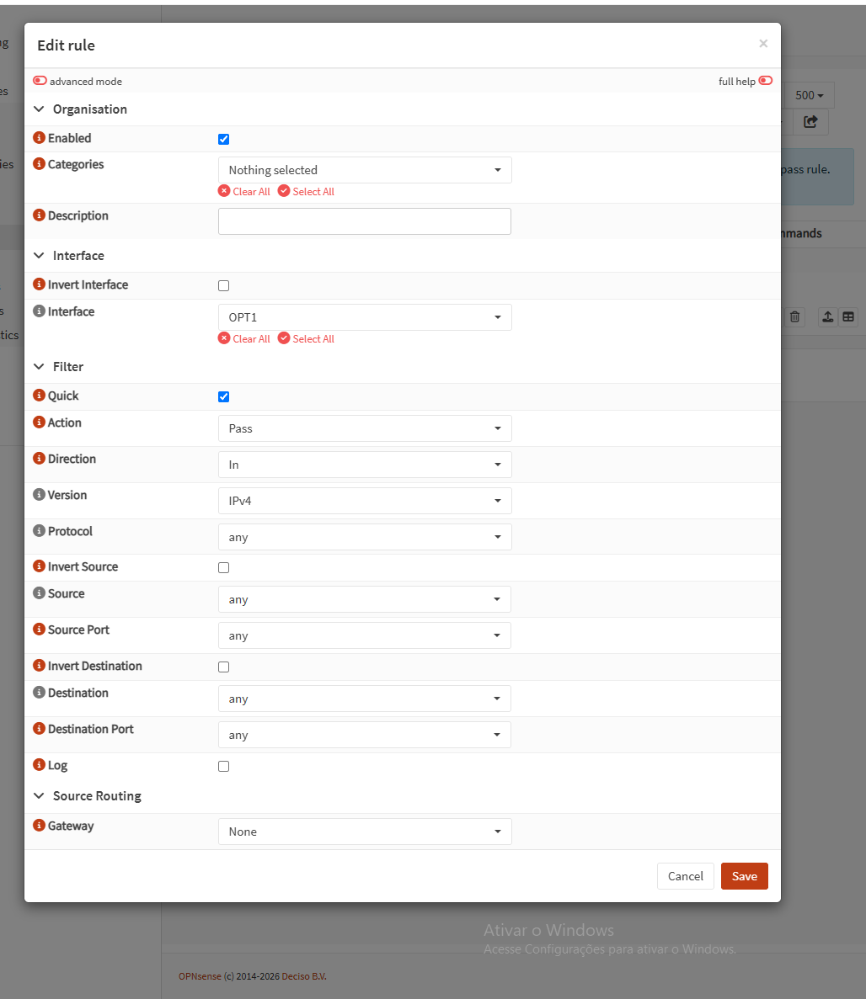
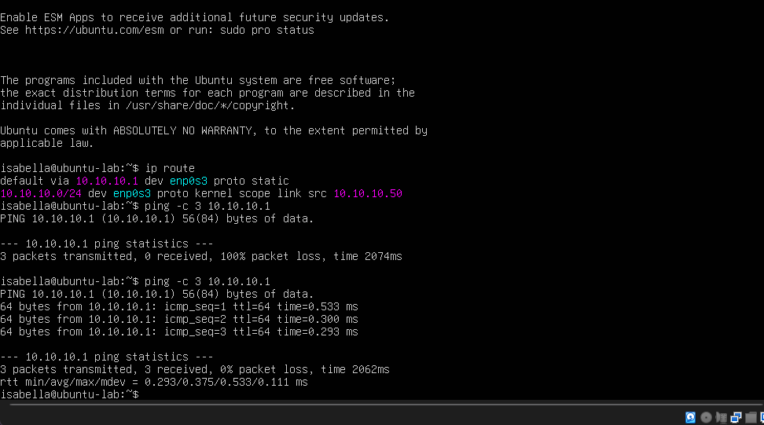
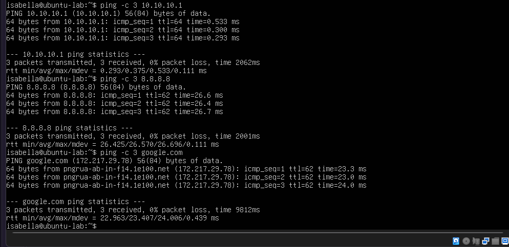

# Ligando o Ubuntu na LAB-LAN

A LAB-LAN é uma rede interna do VirtualBox. Só o Ubuntu e a OPT1 do OPNsense estão nela, então o Ubuntu depende do firewall para qualquer coisa fora dessa rede.

## Interfaces do OPNsense

| Interface | Placa | Rede no VirtualBox | Endereço |
|---|---|---|---|
| WAN | em0 | NAT | 10.0.2.15/24 (DHCP) |
| LAN | em1 | host-only | 192.168.56.10/24, DHCP de .100 a .200 |
| OPT1 | em2 | rede interna LAB-LAN | 10.10.10.1/24 |

## A rota estava certa

No Ubuntu, a rota padrão aponta para 10.10.10.1 pela `enp0s3`.

## O ping não passava

O primeiro ping para o gateway deu 100% de perda.

O IP da OPT1 já estava certo. O problema era outro: interface nova no OPNsense não tem regra de firewall, e sem regra ele bloqueia tudo que entra por ela.

## Regra temporária

Para destravar, criei uma regra na OPT1 liberando tudo: Pass, direção In, IPv4, protocolo any, origem any e destino any. Era só para testar. Depois troquei por regras restritas, em [regras-restritas.md](regras-restritas.md).

Com a regra, o ping ao gateway passou.

O ping para 8.8.8.8 também respondeu, com ttl 62, e o google.com resolveu. Então a saída pela WAN e o DNS estavam funcionando.

