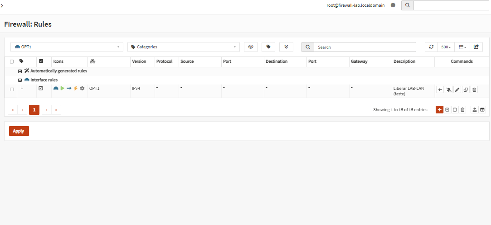
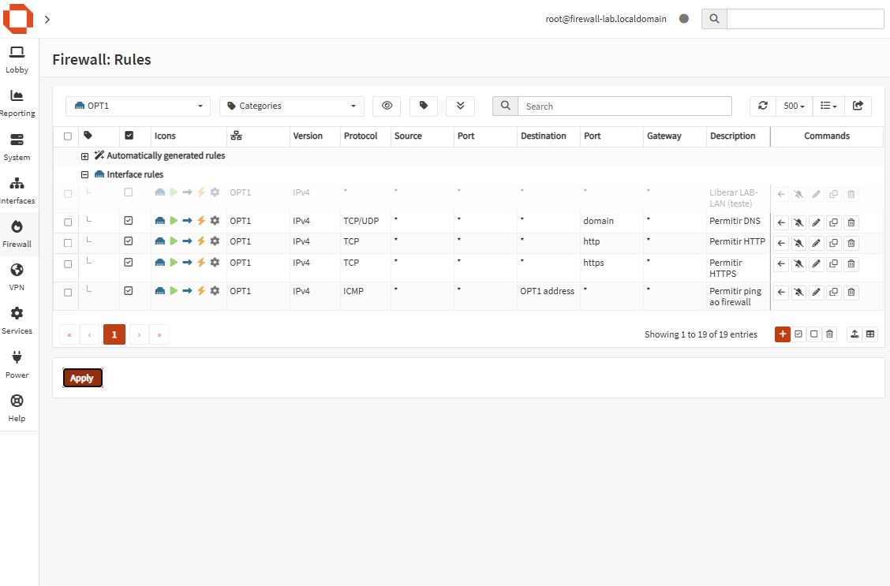
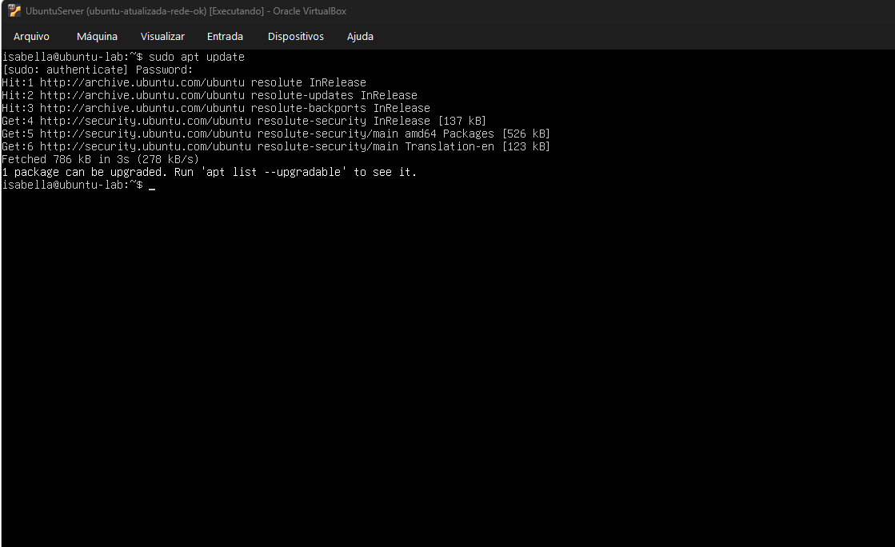
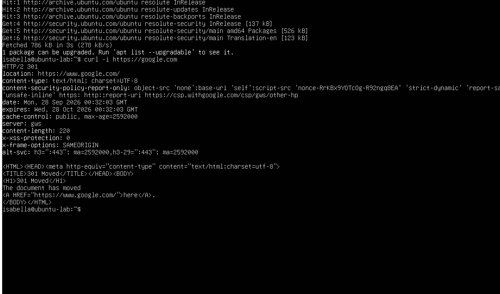
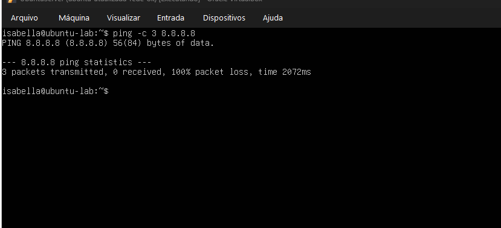

# Regras restritas na OPT1

A regra Pass any resolveu o teste, mas deixava o Ubuntu sair para qualquer lugar, em qualquer porta. Troquei por regras que liberam só o que ele usa.

Antes, a OPT1 tinha só a regra de teste.

## Regras novas

Todas são Pass, direção In, IPv4, na OPT1.

| Descrição | Protocolo | Destino | Porta |
|---|---|---|---|
| Permitir DNS | TCP/UDP | any | 53 |
| Permitir HTTP | TCP | any | 80 |
| Permitir HTTPS | TCP | any | 443 |
| Permitir ping ao firewall | ICMP | OPT1 address | |
| Liberar LAB-LAN (teste) | any | any | any (desativada) |

A regra de teste eu desativei, não apaguei. Depois cliquei em Apply.

## Testes

O `apt update` continuou funcionando. Os repositórios do Ubuntu usam HTTP, e o nome resolve pelo DNS liberado.

O `curl` num site HTTPS também passou.

O ping para o gateway 10.10.10.1 continuou funcionando, porque o ICMP está liberado com destino no próprio firewall.

O ping para 8.8.8.8 deu 100% de perda. É o resultado que eu queria: ICMP para fora não está liberado.

