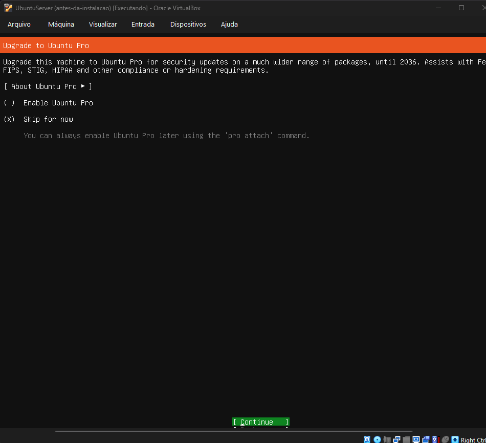
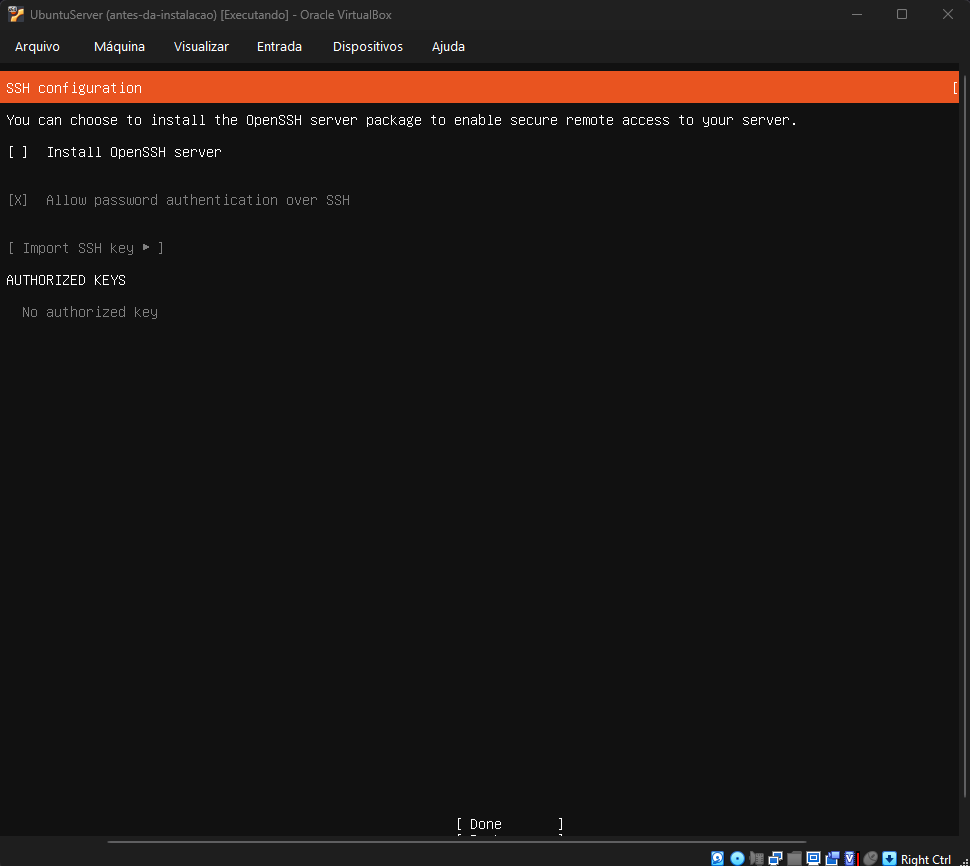
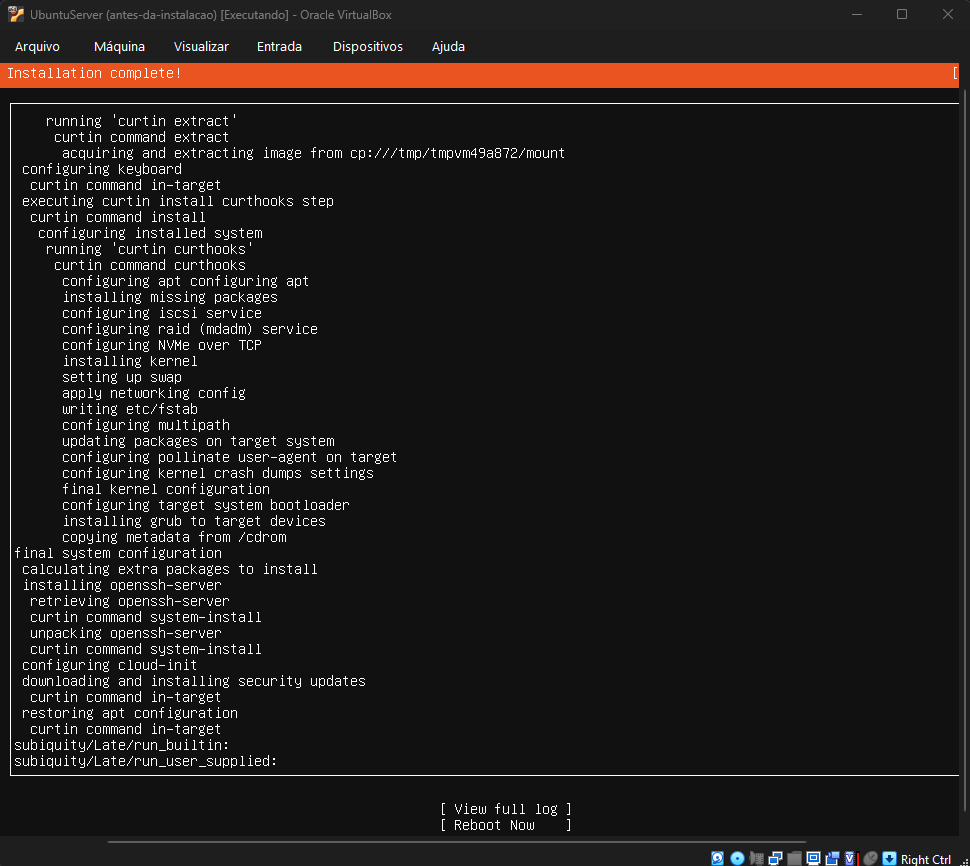
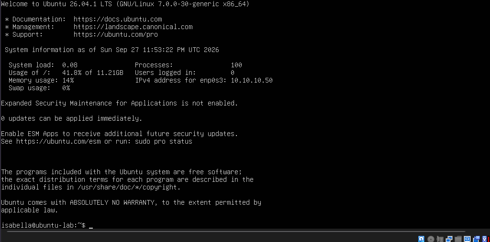
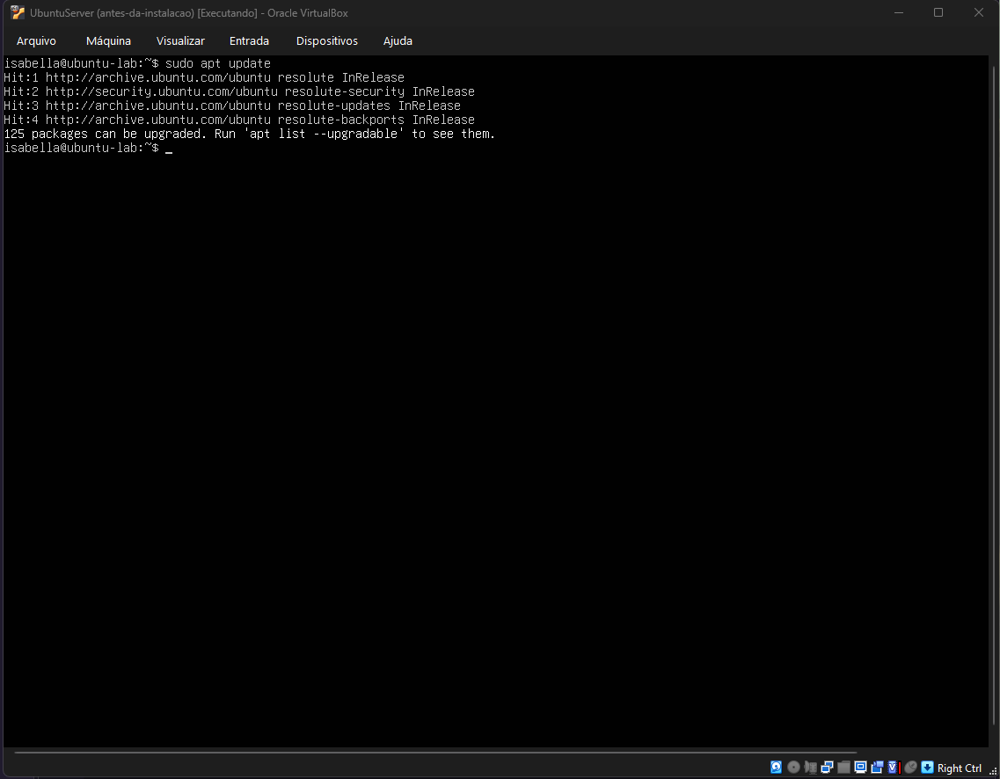
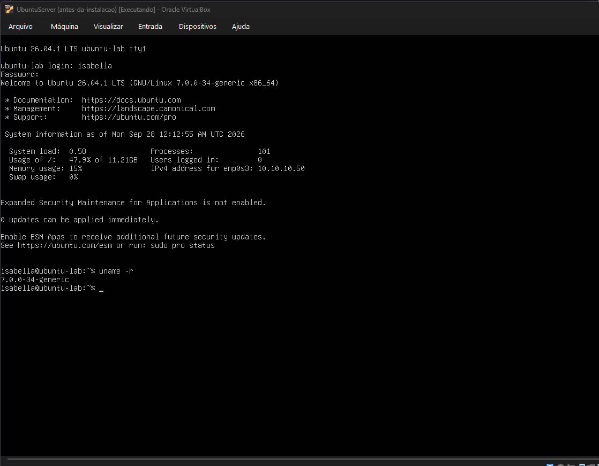

# Ubuntu Server

Instalei o Ubuntu Server 26.04.1 LTS na VM `UbuntuServer`. O hostname é `ubuntu-lab`, e a única placa de rede (`enp0s3`) fica na LAB-LAN com IP fixo 10.10.10.50/24 e gateway 10.10.10.1, que é a OPT1 do OPNsense.

Configurei o IP fixo 10.10.10.50/24, com gateway 10.10.10.1, na tela de rede do instalador.

## Instalação

Na tela do Ubuntu Pro, escolhi Skip for now.

Na tela de SSH, o print mostra a opção ainda desmarcada. Marquei Install OpenSSH server logo depois. Deixei a autenticação por senha permitida e não importei nenhuma chave.

A etapa configuring apt demorou. Depois a instalação terminou normal.

No primeiro login, o banner já mostrou o IP 10.10.10.50 na `enp0s3`.

## Atualização

Atualizei depois de liberar a saída da LAB-LAN no firewall, como conto em [rede-lab-lan.md](rede-lab-lan.md).

O `apt update` baixou 34,4 MB e mostrou 125 pacotes para atualizar.

Rodei `sudo apt upgrade` e reiniciei. O kernel passou de 7.0.0-30 para 7.0.0-34.

Com o sistema atualizado e a rede funcionando, tirei um snapshot da VM chamado `ubuntu-atualizada-rede-ok`.

Ainda não testei o SSH a partir do Windows.
